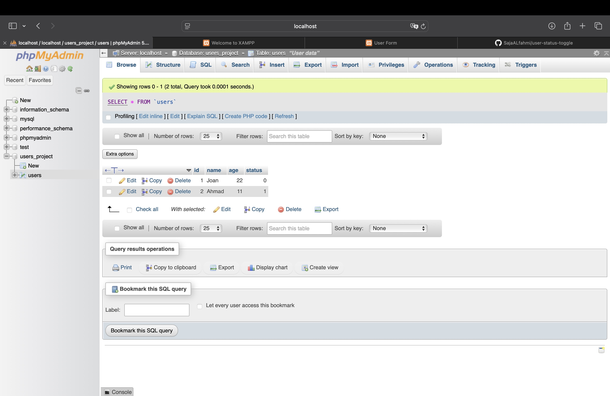

# User Status Toggle Project

This is a simple web project built with HTML, CSS, JavaScript, PHP, and XAMPP.

## 💡 Project Idea

- A form to enter `name` and `age`.
- Submitted data is saved into a MySQL database (`users` table).
- All user records are displayed in a table below the form.
- Each row has a "Toggle" button to change the `status` (0 or 1).
- Status updates are reflected immediately without refreshing the page 

## 📁 Project Files

- `index.php`: Main page with the form and user table.
- `user_insert.php`: Handles form submission and inserts data into the database.
- `toggle_status.php`: Toggles the status of a specific user.
- `view.php`: Loads all users and displays them in a table.
- `script.js`: JavaScript for form handling and dynamic updates.
- `style.css`: Stylesheet for UI design.
- `user-project.sql`: SQL file to create the database and table.
- `demo.mp4`: Screen recording showing how the project works.
- `phpmyadmin-proof.jpg`: Screenshot from phpMyAdmin showing inserted data.

## 🧪 How to Use

1. Start Apache and MySQL from XAMPP.
2. Create a database called `users_project` and import `user-project.sql` using phpMyAdmin.
3. Place the project files in `htdocs/users_project/`.
4. Open `http://localhost/users_project/index.php` in your browser.
5. Add a new user (name & age), and press Submit.
6. Use the Toggle button to activate/deactivate users.

## ✅ Project Demo

📷 Database Screenshot:

🎥 Demo Video:
Included in this repo as `demo.mov`.

